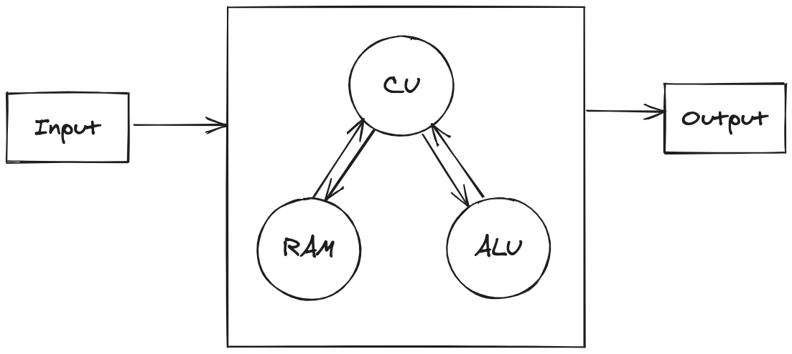

# CPU simulator in C++

**The project was developed for Linux and macOS operating systems**

> ## Table of contents
> - [Architecture](#architecture)
> - [How to build project](#how-to-build-project)
> - [How to use](#how-to-use)
> - [CPU operation codes](#cpu-operation-codes)
> - [Error codes](#error-codes)


## Architecture

--------------------------------------------------------------




## How to build project

--------------------------------------------------------------

This project uses the conan package manager.

- **Install conan using pip:**
    ```bash
    pip install conan
    ```

- **We need a Conan profile to build our project:**
    ```bash
    conan profile detect --force
    ```

- **Used Cmake builder, install it:**
    ```bash
    sudo apt-get -y install cmake
    ```

- **Clone the project:**
    ```bash
    git clone https://github.com/KhachaturAvetisyan/CPU-simulator.git
    ```

- **Create a build directory:**
    ```bash
    mkdir build && cd build
    ```
  
- **Build project:**
    ```bash
    cmake ..
    cmake --build .
    ```

- **Run unit tests:**
    ```bash
    ctest
    ```
  
- **Run project:**
    ```bash
    ./CPU_simulator
    ```

## How to use

--------------------------------------------------------------

Run program and enter CPU operation code and operands.

**Example:**

```bash
PUSH
5
PUSH
6
ADD
POP
```

## CPU operation codes

--------------------------------------------------------------

| Operation code | Description                                                   |
|----------------|---------------------------------------------------------------|
| PUSH           | Pushes operand to the stack                                   |
| POP            | Pops operand from the stack                                   |
| ADD            | Adds two operands from the stack                              |
| SUB            | Subtracts two operands from the stack                         |
| AND            | Performs bitwise AND operation on two operands from the stack |
| OR             | Performs bitwise OR operation on two operands from the stack  |
| NOT            | Performs NOT operation on one operand from stack              |
| LSHIFT         | Performs left shift operation on one operand from the stack   |
| RSHIFT         | Performs right shift operation on one operand from the stack  |

## Error codes

--------------------------------------------------------------

| Error code         | Description                        |
|--------------------|------------------------------------|
| INVALID_OPCODE     | Invalid operation code was entered |
| STACK_OVERFLOW     | Stack overflow error               |
| STACK_UNDERFLOW    | Stack underflow error              |
| INVALID_INPUT      | Invalid number was entered         |
| INVALID_INPUT_SIZE | Invalid input size was entered     |